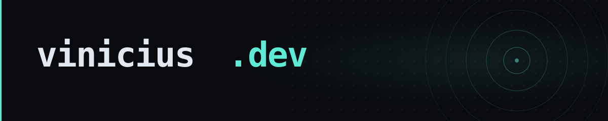

<div align="center">



---

[](https://viniciusdc.github.io) [](https://github.com/viniciusdc/viniciusdc.github.io/actions/workflows/deploy.yml)
   

</div>

---

## Commands

```sh
make install      # npm install
make dev          # dev server → http://localhost:4321
make build        # production build → dist/
make preview      # serve dist/ locally
make check        # type-check + spell-check
make banner       # regenerate .github/banner.svg
```

## Project structure

```
src/
├── layouts/           # Layout.astro, ArticleLayout.astro
├── pages/
│   ├── index.astro    # homepage
│   ├── notes/         # field notes       ← gitignored, committed via content PRs
│   ├── architecture/  # design essays     ← gitignored, committed via content PRs
│   ├── projects/      # project writeups
│   ├── debug/         # debugging reference
│   └── about/
├── components/ui/     # Badge.astro and other primitives
├── styles/global.css
└── templates/         # note.mdx and architecture.mdx starters
public/                # favicon and static assets
scripts/               # gen-banner.mjs, new-post.sh
```

## Writing a post

Scaffold a new post with `make post` — the slug is derived from the title automatically:

```sh
make post TITLE="k3s coredns loop"                          # field note (default)
make post TITLE="k3s coredns loop" TAG="debugging"          # custom tag
make post TITLE="operator ownership boundaries" TYPE=arch   # architecture essay
```

Posts are `.mdx` files. Each exports a `metadata` object that the homepage and index pages discover at build time — no manual registration needed:

```ts
export const metadata = {
  title: "Short, specific title",
  date: "YYYY-MM-DD",
  tag: "field note",   // field note · debugging · security · architecture · platform
  description: "One sentence describing what this explains.",
};
```

## CI / CD

| Job | Trigger | |
|---|---|---|
| Build | PR | Compiles the site and uploads `dist/` as an artifact |
| Spell check | PR | cspell over all `.astro` and `.mdx` source files |
| Lighthouse | PR | Accessibility, SEO, best-practices ≥ 100 · performance ≥ 90 |
| Deploy | Push to `gh-pages` | Builds and publishes to GitHub Pages |

Actions are pinned to commit SHAs. Dependabot opens weekly PRs to keep action SHAs and npm deps current.
